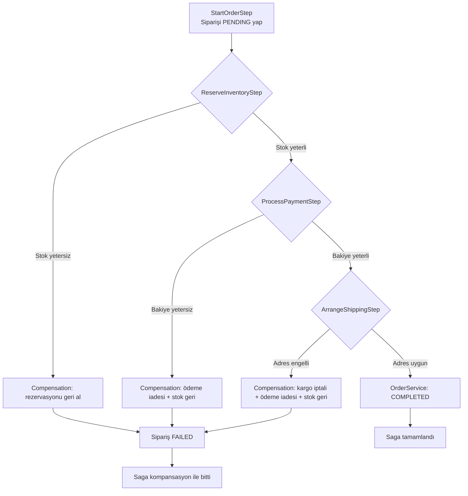

# Coffee Order Saga Sample

This project demonstrates the **Saga orchestration pattern** in plain Java with a realistic e-commerce scenario.  
Placing a coffee order requires four distributed operations:

1. Mark the order as pending
2. Reserve inventory
3. Capture customer payment
4. Schedule shipping

If any operation fails, the saga orchestrator triggers compensating actions that roll the order back to a safe state (release inventory, refund the payment, cancel shipping).

## Running the sample

The project uses only the JDK; no external dependencies are required.

```bash
# Compile
javac -d out $(find src/main/java -name "*.java")

# Happy path run
java -cp out com.example.saga.Main

# Simulate different failure scenarios
java -cp out com.example.saga.Main low-balance      # payment failure with compensation
java -cp out com.example.saga.Main out-of-stock     # inventory failure with compensation
java -cp out com.example.saga.Main blocked-address  # shipping failure
```

Each run prints the saga log, final order status, and the state of supporting services so you can see both the forward and compensating paths of the saga.

## Senaryo Akış Dokümanı

### Genel Bakış
Bu örnek, bir kahve siparişi için saga orkestrasyonunun uçtan uca nasıl çalıştığını gösterir. Sipariş ilk olarak `Main` sınıfında oluşturulur ve `SagaOrchestrator`, tanımlı adımları sırasıyla çalıştırır:

1. `StartOrderStep` – siparişi `PENDING` durumuna çeker.
2. `ReserveInventoryStep` – stok rezervasyonu yapar.
3. `ProcessPaymentStep` – ödemeyi çeker.
4. `ArrangeShippingStep` – kargo planlar ve siparişi `COMPLETED` yapar.

Her adım başarısız olursa, zaten tamamlanmış adımlar `compensate` metodlarıyla geri alınır. Böylece sistem tutarlı kalır.

### Senaryolar

- `success` (veya parametresiz): Her adım başarıyla tamamlanır, sipariş `COMPLETED` olur.
- `low-balance`: Ödeme adımı, bakiye yetersiz olduğu için hata verir. Rezerv edilen stok geri bırakılır, sipariş `FAILED` olur.
- `out-of-stock`: Stok yetersizliği nedeniyle rezervasyon adımı hata verir. Saga erken sona erer, sipariş `FAILED` olur.
- `blocked-address`: Kargo planlama adımı adres engelinden dolayı hata verir. Ödeme iade edilir, stok serbest bırakılır, sipariş `FAILED` olur.

### Kodda İzlenecek Noktalar

- `com.example.saga.Main`: Senaryoyu seçer, servisleri oluşturur ve orkestrasyonu başlatır.
- `com.example.saga.saga.SagaOrchestrator`: Adımları sıralı çalıştırır, hata durumunda kompansasyon başlatır.
- `com.example.saga.steps.*`: Her bir iş adımının hem `process` hem kompansasyon mantığı burada bulunur.
  - `StartOrderStep`: Siparişi başlatır.
  - `ReserveInventoryStep`: Stok rezervasyonu yapar, gerekirse geri bırakır.
  - `ProcessPaymentStep`: Ödemeyi çeker veya iade eder.
  - `ArrangeShippingStep`: Kargo planlar, başarısız olursa iptal eder.
- `com.example.saga.service.*`: Basit in-memory servisler; stok, ödeme ve kargo durumlarını simüle eder.

Bu doküman sayesinde, komut satırından çalıştırdığınız her senaryonun kodda hangi parçalara dokunduğunu ve hangi kompansasyon akışlarının devreye girdiğini izleyebilirsiniz.

### Akış Diyagramı


